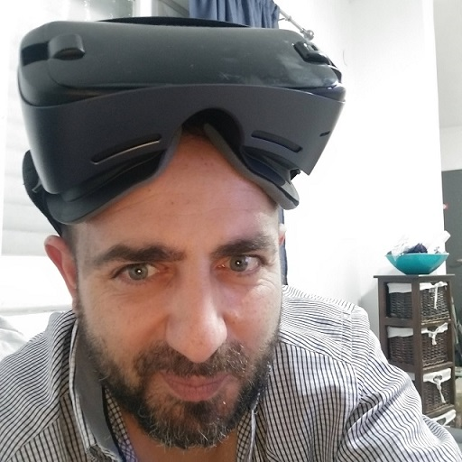

# Hey everyone!
My name is Ilan Laloum and I am an accredited full-stack Software Engineer who happens to know a thing or two about designing successful strategic software projects that streamline operational processes and influence new levels of high-performing security.

I am a respected freelancer who has pioneered numerous strategic software projects for government organizations, banks, insurance companies, hospitals, and much more.

Overall, I built my freelancing services on a foundation of transparency, trust, and integrity and aim to not only meet my customers’ expectations but exceed them every time. 

	
	

	
### Ilan Laloum
	

	
### ___Science, technology, and the Internet are the ones that will bind all of humanity together.__ (just me)_

	
	
	

Active in the development groups of Microsoft partners and Google developers, with the more notable highlight being my creation of a POC that now serves over 100K Google Workspace users. 

This fully wrapped B2B product works both as a standalone SaaS solution running on Microsoft Azure and as a cloud-based product that responds to every stringent regulation required to grant access to internal organizational data.

## A little bit about myself

As one of the last remaining extinct species of Gen-X Software Engineers, I have an extensive background and passion for this field and demonstrate that by delivering user-friendly, innovative software developments that result in secured integrations and positive experiences every time. 

I have always been a huge tech kid, avidly reading and studying the intricacies of science and technology ever since I can remember. Not to toot my own horn, but by the time I turned eight years old, I wrote the first computer program of 1983.

From then to now, I have only gotten sharper and more proactive in the field, leading to my rooted expertise in every aspect of the software project lifecycle to ensure its success. 

All in all, nothing makes me happier than being able to live out my passion for implementing technology innovations and being a valuable resource for illustrious organizations to obtain their software upgrade goals. 

This, in conjunction with my advocacy for the Agile, Scrum, and K.I.S.S. (keep it simple stupid) methodologies, and a strong reputation for maintaining the strict standards of both development and information security in every design, can solidify your confidence that your full-scale software objectives are in the best possible hands from the blueprint stage to execution.

In the end, I love what I do and am continuously learning something new about this ever-evolving industry daily. Don’t even get me started on the hot topic of AIs. 

However, when I am not collaborating with a C-Level business leader or government official on their dynamic software projects, I dedicate some of my free time volunteering at elementary schools to teach children about the basics of computers and the Internet.

I believe that investing in technology education at an early age is exceptionally important for kids, especially as they grow up within this massively advanced digital world. 