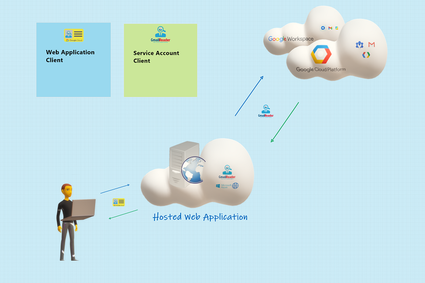
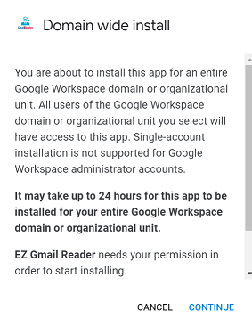
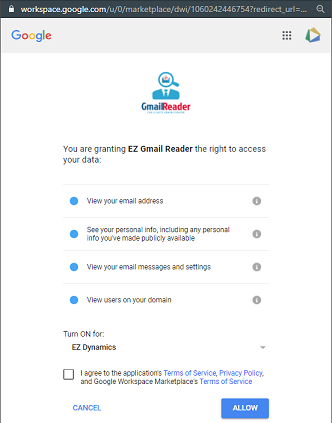
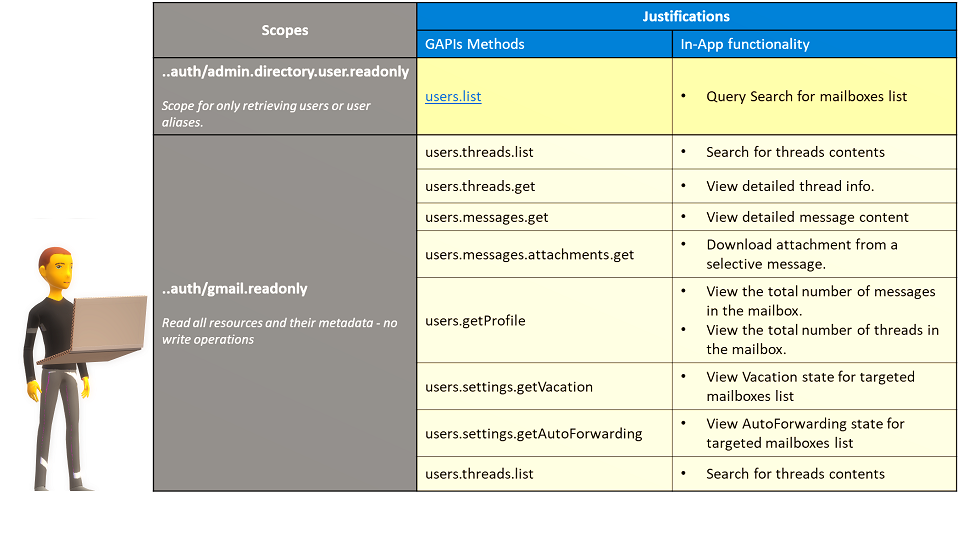

# Granted Access - For Gmail Reader

## Principales
We use a Google Service account client, allows our back-server, call Google APIs, on behalf of you.

This design scenario also called, "two-legged OAuth", In which the application calls Google APIs, on behalf of end-users, anonymously, and without knowing their passwords.

	

## Domain-wide authority
When Google Workspace administrators initiate domain installs from Google Workspace Marketplace, the administrator will go through processes of Grant this app Domain-wide authority access

	

## Access to **[Sensitive](https://support.google.com/cloud/answer/9110914#sensitive-scopes) & [Restricted](https://support.google.com/cloud/answer/9110914#restricted-scopes)** data scopes

When Google Workspace administrators initiate domain installs from Google Workspace Marketplace, the administrator will go through processes of Grant this app access permission to sensitive & restricted data scopes

#### Why specific scopes are justified and why they are no more than the minimum required for application functionality?
+ Access permissions to the Sensitive data scope of `/auth/gmail.readonly` is granted, allow view user's email messages and settings.  
+ Access permissions to the Restricted data scope of `/auth/admin.directory.user.readonly` is granted, allow to view the domain users list.

	

### Granted Access summery table

	

