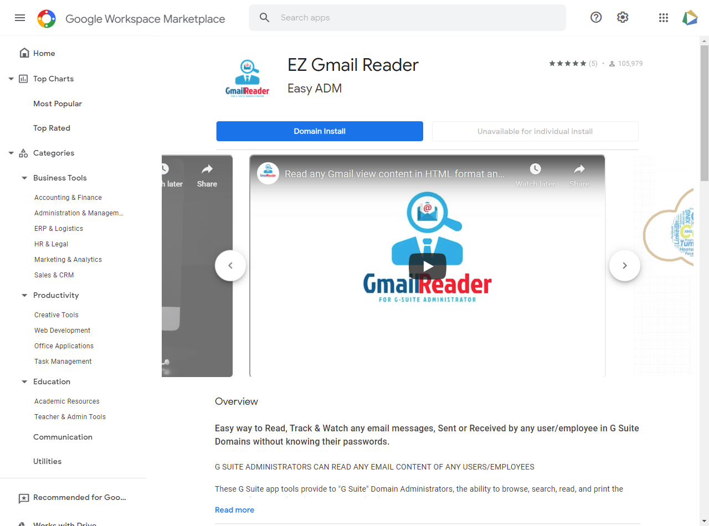
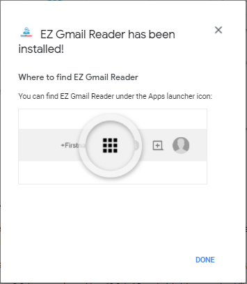

# How to Install Gmail Reader
Below is information on how to install and manage this app, and how to use with Google Workspace organization.

## Step 1 - Install
Open the <a href="https://workspace.google.com/marketplace/app/ez_gmail_reader/1060242446754" target="_blank" title="Gmail Reader at Google Workspace Marketplac">Google Workspace Marketplace</a> app page
and  click `DOMAIN INSTALL` blue button, Accept the terms and grant access to complete.

	

__WE HIGHLY RECOMMENDED  leave the default value in the google sub-organizations combo to users in the entire domain.__

## Step 2 - Open the app
Once installed, apps are accessible through the App Launcher. 

	

## Jum to [How to use](how-to-use.md)

## See how to install video

<iframe width="560" height="315" src="https://www.youtube.com/embed/27fVbMOh_Ec" title="YouTube video player" frameborder="0" allow="accelerometer; autoplay; clipboard-write; encrypted-media; gyroscope; picture-in-picture" allowfullscreen></iframe>
  

