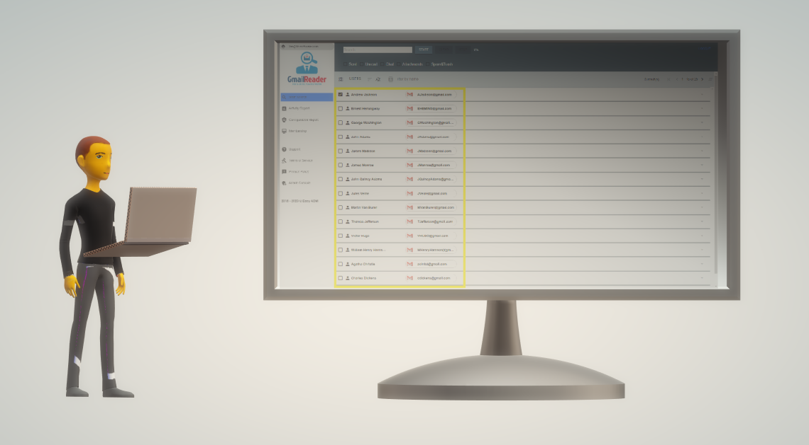
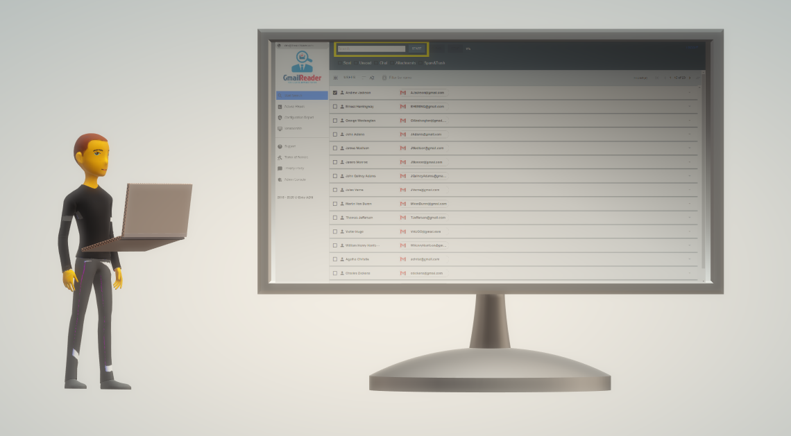
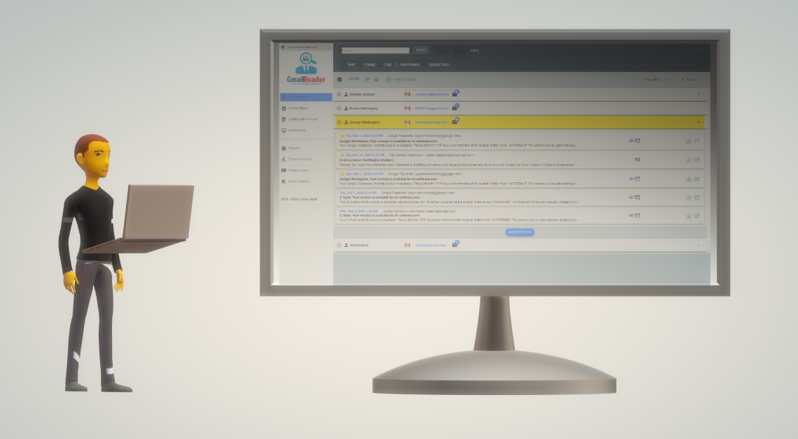
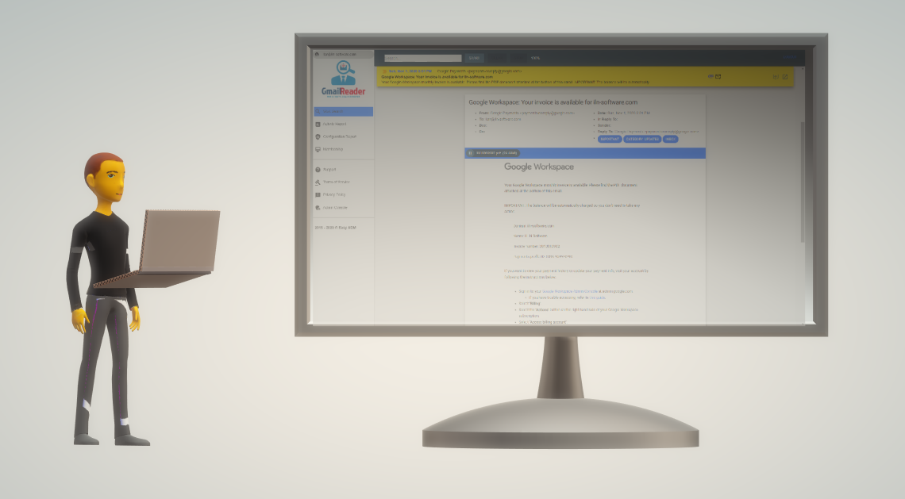
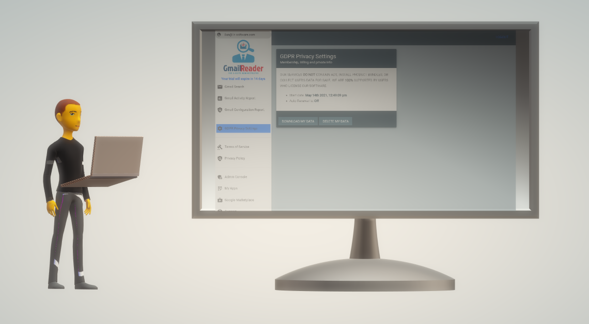

# How to use Gmail Reader
 This document is written for %meta.gw% administrator will guide Gmail admins on how to use the Gmail Reader user interface

### 1. [Sign in Gmail Reader](#app-launcher)
### 2. [Mark multiple  accounts for the search](#cross-account-search)
### 3. [Add text query or use advanced operator (optional)](#add-search-operator)
### 4. [Start search](#start-search)
### 5. [Delete my data](#delete-my-data)

## See user guide video

<iframe width="560" height="315" src="https://www.youtube.com/embed/27fVbMOh_Ec" title="YouTube video player" frameborder="0" allow="accelerometer; autoplay; clipboard-write; encrypted-media; gyroscope; picture-in-picture" allowfullscreen></iframe>
  

 

* * *
 

 

## 1. Sign in Gmail Reader
> #### Once [Installed](how-to-install-gmail-reader.md) 
 The __Gmail Reader__ apps is accessible through the Google App Launcher.

When you sign in to __Gmail Reader__ you must authenticate with your Google super admin credentials and accept the privacy policy and terms of service.

	
Use the 14 days free trial version first, and only if the application suits your requirements, proceed to establish a payment agreement

* * * 
 

 
 ## 2. Mark multiple  accounts for the search

 

 The __Gmail Reader__ supports cross-account search, you can select any Gmail account in your domain for the search process.
 

	 
	

* * *

## 3. Add text query or use advanced operator (optional)

The __Gmail Reader__ supports cross-account search, you can select any Gmail account in your domain for the search process.

You can use words or symbols called search operators to filter your Gmail search results.
 
### read more about [Advadnce search operators](advanced-search-operators.md)
 
 * * *

## 4. Start search.

Click the "START" button when you ready, and wait for the search process to end.

## Display search results
+ Click any account to expand the result summary regarding the account, The summary view highlight result threads info.
+ Click any Thread results to expand and display thread messages

	

View detailed message content or download the attachments

 

***

## 5. Manage my personal data.

	Navigate in app menu.	
	

	

